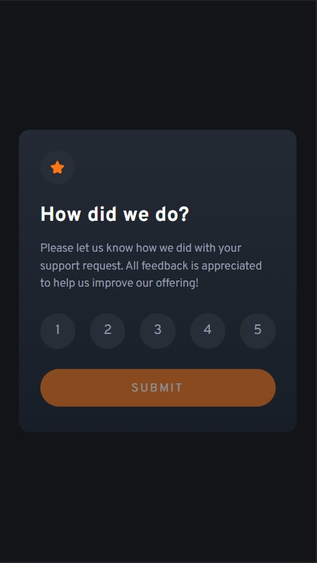

# Frontend Mentor - Interactive rating component solution

This is a solution to the [Interactive rating component challenge on Frontend Mentor](https://www.frontendmentor.io/challenges/interactive-rating-component-koxpeBUmI). Frontend Mentor challenges help you improve your coding skills by building realistic projects.

## Table of contents

- [Overview](#overview)
  - [The challenge](#the-challenge)
  - [Screenshot](#screenshot)
  - [Links](#links)
- [My process](#my-process)
  - [Built with](#built-with)
  - [What I learned](#what-i-learned)
  - [Continued development](#continued-development)
- [Author](#author)

## Overview

### The challenge

Users should be able to:

- View the optimal layout for the app depending on their device's screen size
- See hover states for all interactive elements on the page
- Select and submit a number rating
- See the "Thank you" card state after submitting a rating

### Screenshot





### Links

- [Solution URL](https://your-solution-url.com)
- [Live site](https://zp021-frontend-mentor-rating.netlify.app/)

## My process

### Built with

- Semantic HTML5 markup
- CSS custom properties
- Flexbox
- Mobile-first workflow

### What I learned

Doing this challenge I figured out how to make the button inaccessible util the user has selected a rating. It took some googling, but eventually got it to work.

```js
window.addEventListener("load", () => {
  submitButton.disabled = true;
});

ratings.forEach((rating) => {
  rating.addEventListener("click", () => {
    submitButton.disabled = false;
    userRating.innerHTML = rating.innerHTML;
  });
});
```

### Continued development

I'm looking forward to solving more challenges with javascript, since I find that I learn better implementing what I learned on these real life situations.

## Author

- Frontend Mentor - [@zp021](https://www.frontendmentor.io/profile/zp021)
- GitHub - [@zp021](https://github.com/zp021)
